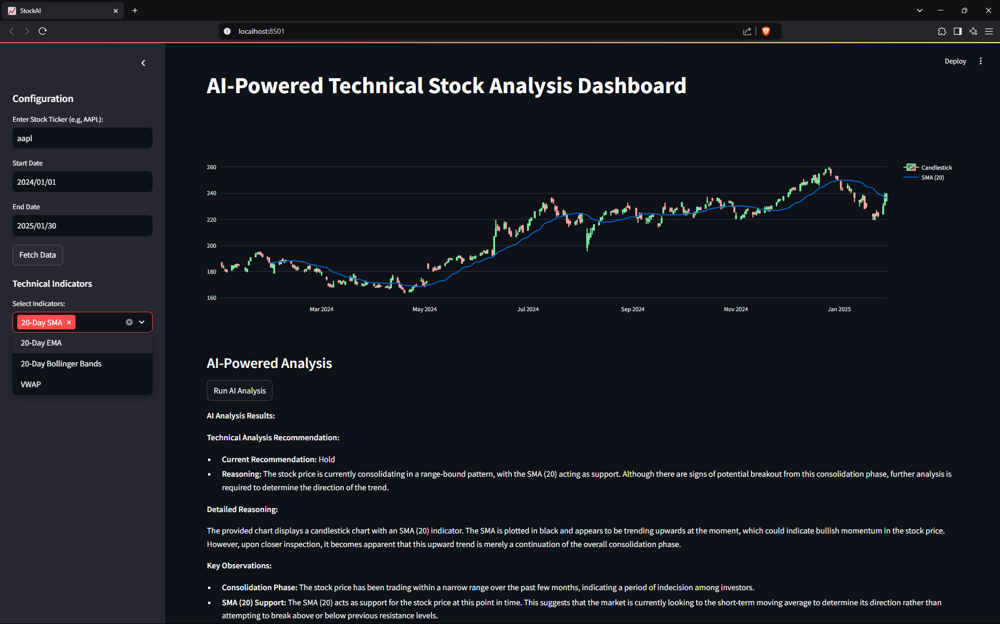

Here’s a **teenage-like, emoji-filled, yet professional README** for your GitHub repository. It includes credit to the original creator, instructions on how to run the code, details about the LLM used, and a spot for your `Result.png` image.

---

# 📈 AI-Powered Stock Analysis Dashboard 🚀

Welcome to my **AI-Powered Technical Stock Analysis Dashboard**! 🎉 This project was inspired by a super cool tutorial from **Deep Charts** on YouTube. I followed along, added my own flair, and now I’m sharing it with you! 🤖📊

---

## 🌟 **What’s This Project About?**

This project is a **Streamlit-based dashboard** that lets you analyze stock data using **AI-powered technical analysis**. You can:
- Fetch stock data 📉
- Visualize candlestick charts 🕯️
- Add technical indicators like SMA, EMA, Bollinger Bands, and VWAP 📊
- Get **AI-generated insights** using **LLaMA 3.2 Vision** 🤖✨

---

## 🎥 **Credit Where It’s Due**

This project is based on the following resources:
1. **YouTube Tutorial**: [Build an AI-Powered Technical Analysis Stock Dashboard in Python with Streamlit and Ollama](https://www.youtube.com/watch?v=N3ttsxgcP9I&t=108s) by **Deep Charts**.
2. **Blog Post**: [Build an AI-Powered Technical Analysis](https://deepcharts.substack.com/p/build-an-ai-powered-technical-analysis) by **Deep Charts**.

Big shoutout to **Deep Charts** for the amazing tutorial! 🙌 If you like this project, go check out their content—it’s awesome! 🚀

---

## 🛠️ **How to Run the Code**

Follow these steps to get this dashboard up and running on your machine:

### 1. **Clone the Repository**
```bash
git clone https://github.com/your-username/AI-StockAnalysis.git
cd your-repo-name
```

### 2. **Install Dependencies**
Make sure you have Python installed, then run:
```bash
pip install -r requirements.txt
```

### 3. **Run the Streamlit App**
```bash
streamlit run app.py
```

### 4. **Open the Dashboard**
Once the app is running, open your browser and go to:
```
http://localhost:8501
```

---

## 🤖 **Why LLaMA 3.2 Vision?**

I used **LLaMA 3.2 Vision** as the LLM (Large Language Model) because:
- It’s **super powerful** and can analyze images (like our stock charts) 🖼️.
- It provides **detailed, actionable insights** based on technical indicators 📈.
- It’s **open-source** and easy to integrate with Python 🐍.

---

## 📸 **Screenshot of the Dashboard**

Here’s what the dashboard looks like in action:



---

## 🚀 **Features**
- **Stock Data Fetching**: Enter any stock ticker (e.g., AAPL, TSLA) and get real-time data 📈.
- **Candlestick Charts**: Visualize stock prices with interactive charts 🕯️.
- **Technical Indicators**: Add SMA, EMA, Bollinger Bands, and VWAP to your charts 📊.
- **AI Analysis**: Get AI-generated buy/hold/sell recommendations 🤖✨.

---

## 💡 **How It Works**
1. Enter a stock ticker and date range.
2. Fetch the data and visualize it using a candlestick chart.
3. Add technical indicators to the chart.
4. Click **"Run AI Analysis"** to get insights from LLaMA 3.2 Vision.

---

## 📂 **Project Structure**
```
AI-StockAnalysis/
├── app.py                # Main Streamlit app code
├── requirements.txt      # List of dependencies
├── Result.png            # Screenshot of the dashboard
└── README.md             # This file!
```

---

## 🙏 **Acknowledgments**
- **Deep Charts** for the amazing tutorial and inspiration.
- **Streamlit** for making it easy to build interactive dashboards.
- **Ollama** for providing the LLaMA 3.2 Vision model.

---

## 📜 **License**
This project is licensed under the **MIT License**. Feel free to use, modify, and share it! 🎉

---

## 🚨 **Disclaimer**
This project is for **educational purposes only**. I’m not a financial advisor, and this tool should not be used for making real-world trading decisions. Always do your own research! 📚

---

Enjoy the project! If you have any questions or suggestions, feel free to reach out. Happy coding! 🚀✨